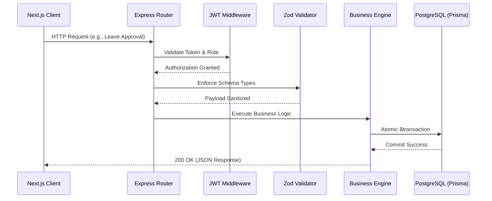

<div align="center">

  <h1 align="center">Shiftly HRMS</h1>

  <p align="center">
    <strong>Every workday, perfectly aligned.</strong>
    <br />
    A modern, lightweight, and offline-capable Human Resource Management System.
  </p>

  <p align="center">
    <a href="https://odoo-hackathon-shiftly.vercel.app/" target="_blank"></a>
  </p>

  <p align="center">
    <a href="#-core-philosophy"></a>
    <a href="#-architecture"></a>
    <a href="#-tech-stack"></a>
  </p>
</div>

<hr />

## 📋 Table of Contents
1. [Core Philosophy](#-core-philosophy)
2. [Key Capabilities](#-key-capabilities)
3. [System Architecture](#-system-architecture)
4. [Data Model](#-data-model)
5. [API Structure](#-api-structure)
6. [Getting Started](#-getting-started)

---

## 💡 Core Philosophy

**Shiftly** was engineered to solve the data fragmentation problem inherent in small-to-medium enterprise (SME) HR operations. By moving away from disconnected spreadsheets and legacy cloud suites, Shiftly offers a **unified, transparent data model** that acts as the single source of truth for organizational presence, time-off ledgers, and payroll computation.

Designed as a **local-first** application, Shiftly ensures that highly-sensitive employee data remains within the organization's perimeter, requiring zero external cloud dependencies to function natively.

---

## 🚀 Key Capabilities

<table>
  <tr>
    <td width="50%">
      <h3>🟢 Live Presence Directory</h3>
      <p>A real-time organizational directory reflecting live employee status (Present, On Leave, Absent). Replaces static employee lists with a dynamic presence view akin to modern communication tools.</p>
    </td>
    <td width="50%">
      <h3>⚖️ Transactional Leave Ledger</h3>
      <p>Leave approvals are backed by atomic database transactions. When an Admin approves a request, days are mathematically deducted from the annual allocation, guaranteeing zero race conditions.</p>
    </td>
  </tr>
  <tr>
    <td>
      <h3>🧮 Dynamic Salary Engine</h3>
      <p>A sophisticated payroll module computing percentage-based cascading components (e.g., HRA as % of Basic). Enforces hard caps against over-allocation and auto-calculates statutory deductions (PF/PT).</p>
    </td>
    <td>
      <h3>🔐 Enterprise Onboarding</h3>
      <p>System-generated alphanumeric IDs (e.g., <code>CORP-DS-2026-001</code>) replace manual sign-ups, enforcing standard corporate nomenclature and preventing unauthorized access.</p>
    </td>
  </tr>
</table>

---

## 🏗️ System Architecture

Shiftly employs a decoupled client-server architecture, communicating via strict RESTful endpoints secured by JSON Web Tokens (JWT).

### Request Lifecycle


### Technology Stack
- **Client Presentation:** React 18, Next.js 14, Tailwind CSS
- **API Services:** Node.js, Express.js
- **Data Persistence:** PostgreSQL 16
- **Object Relational Mapping:** Prisma ORM
- **Security Primitives:** bcryptjs (Hashing), Zod (Schema Validation)

---

## 🗄️ Data Model

<details>
<summary><strong>Click to expand Entity Relationship overview</strong></summary>

- **`User` / `Company`:** Multi-tenant architecture foundation. Manages hierarchical reporting lines (`managerId`) and RBAC (`Role` enum).
- **`Attendance`:** Records `checkIn` / `checkOut` timestamps. A background chronological trigger derives daily `workHours` and `extraHours`.
- **`LeaveAllocation` / `LeaveRequest`:** Scoped annually. Ensures an employee cannot consume more `PAID` or `SICK` days than statically allocated.
- **`SalaryStructure` / `SalaryComponent`:** 1-to-N relationship defining the base wage and polymorphic components (`FIXED`, `PERCENT_OF_BASIC`, `PERCENT_OF_WAGE`).

</details>

---

## 💻 API Structure

The Shiftly backend exposes predictable REST APIs. All payloads enforce strict schema validation to guarantee data integrity before hitting the persistence layer.

**Example: Salary Structure Definition Payload**
```json
{
  "wageType": "MONTHLY",
  "fixedWage": 50000,
  "pfEmployeePercent": 12,
  "professionalTax": 200,
  "components": [
    {
      "name": "House Rent Allowance",
      "compType": "PERCENT_OF_BASIC",
      "value": 40
    },
    {
      "name": "Performance Bonus",
      "compType": "FIXED",
      "value": 2000
    }
  ]
}
```

---

## ⚙️ Getting Started

Shiftly is container-ready. We recommend using Docker for the data tier during local development.

### 1. Environment Configuration
```bash
git clone https://github.com/praju455/odoo-hackathon---Shiftly.git
cd odoo-hackathon---Shiftly
docker-compose up -d  # Spin up PostgreSQL
```

### 2. Microservices Boot
*Run these in separate terminal multiplexer panes (e.g., tmux) or standard terminal windows.*

**Pane 1: API Server**
```bash
cd backend
npm install
cp .env.example .env
npm run db:generate && npm run db:migrate
npm run dev
```

**Pane 2: Web Client**
```bash
cd frontend
npm install
npm run dev
```

Access the application at `http://localhost:3001`.

<br />

<div align="center">
  <sub>Engineered for the 8-Hour HRMS Hackathon. Built with discipline.</sub>
</div>
