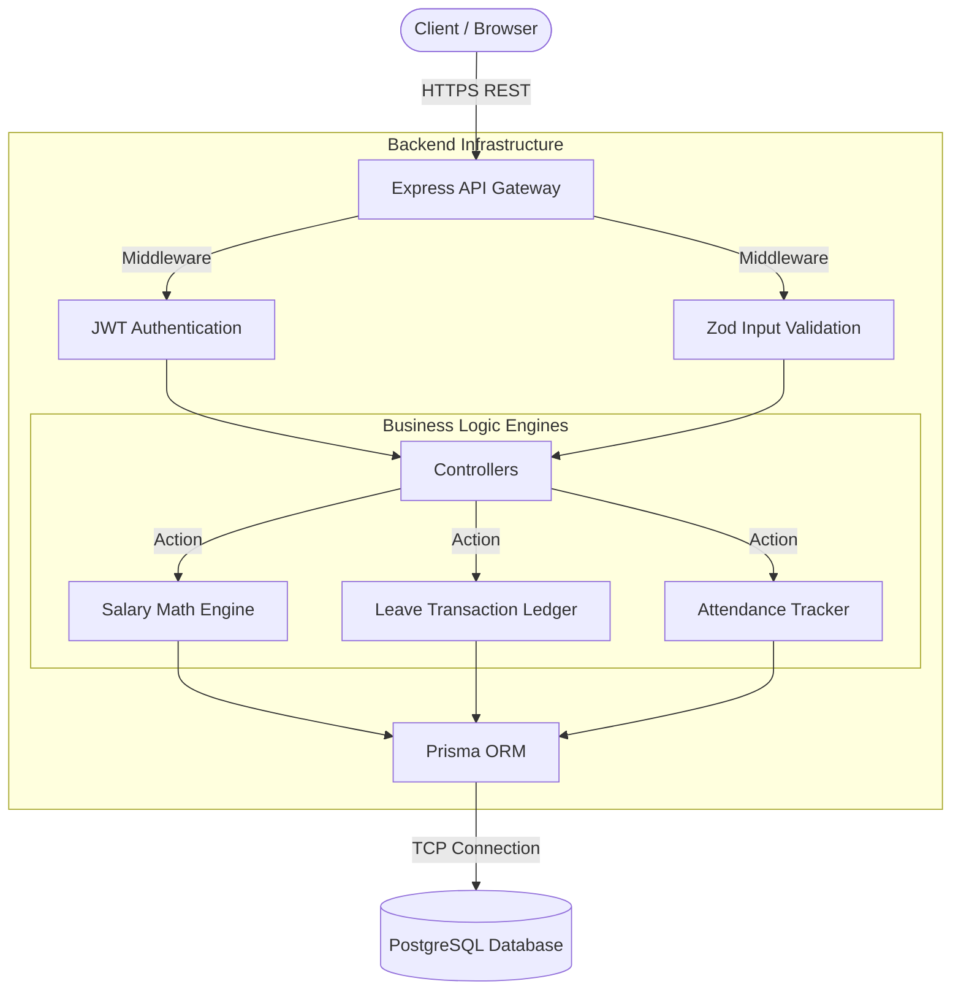

<div align="center">
  
# 🌊 Dayflow HRMS

[](#)
[](#)
[](#)
[](#)
[](#)

*A lightweight, offline-capable Human Resource Management System (HRMS) built to replace spreadsheets with a unified, transparent data model for attendance, leave balances, and salary computations.*

</div>

---

## 🎯 Project Overview

Small organizations often suffer from fragmented HR data: attendance in registers, leave balances in Excel, and salary structures in isolated PDFs. **Dayflow** solves this by unifying these pillars into a single, cohesive, relational database application.

**Key Capabilities:**
*   **Live Presence Directory:** Real-time visibility of employee status (Present, On Leave, Absent) directly on the organizational directory.
*   **Transactional Leave Ledger:** Leave approvals mathematically deduct from an employee's annual allocation via atomic database transactions, ensuring zero race conditions.
*   **Dynamic Salary Engine:** A sophisticated payroll module that computes percentage-based cascading components (e.g., HRA as % of Basic), enforcing hard caps against over-allocation while automatically calculating statutory Provident Fund (PF) and Professional Tax deductions.
*   **Auto-Generated Credentials:** Enterprise-grade onboarding where system-generated IDs (e.g., `CORP-DS-2026-001`) replace manual sign-ups.

---

## 🏗️ Architecture & Tech Stack

Dayflow is engineered for **data integrity** and **local-first deployment**, allowing high-privacy organizations to run it on a local network without cloud vendor lock-in.

### Technology Stack
*   **Client:** React 18, Next.js 14, Tailwind CSS, Axios
*   **Server:** Node.js, Express.js
*   **Database:** PostgreSQL 16 (via Docker)
*   **ORM:** Prisma Client
*   **Security & Validation:** JWT (Auth), Bcrypt (Hashing), Zod (Strict Payload Validation)

### System Flow Diagram



---

## 🗄️ Core Data Model

*   **`User` & `Company`:** Multi-tenant ready schema. Supports role-based access control (Admin vs. Employee).
*   **`Attendance`:** Tracks `checkIn`, `checkOut`, and automatically derives `workHours` and `extraHours`. Statuses: `PRESENT`, `ABSENT`, `HALF_DAY`, `LEAVE`.
*   **`LeaveAllocation` & `LeaveRequest`:** Scoped by calendar year. Requests are bound to specific types (`PAID`, `SICK`, `UNPAID`).
*   **`SalaryStructure` & `SalaryComponent`:** 1-to-many relationship defining the fixed base wage alongside variable/fixed earnings (`PERCENT_OF_BASIC`, `PERCENT_OF_WAGE`, `FIXED`).

---

## 🚀 Quickstart Guide

### 1. Database & Backend
Ensure you have Docker and Node.js installed.

```bash
# 1. Clone & enter directory
git clone https://github.com/praju455/odoo-hackathon---Dayflow.git
cd odoo-hackathon---Dayflow

# 2. Start PostgreSQL
docker-compose up -d

# 3. Setup Backend
cd backend
npm install
cp .env.example .env

# 4. Migrate Database & Start Server
npm run db:generate
npm run db:migrate
npm run dev
# Backend runs on http://localhost:3000
```

### 2. Frontend Application
In a separate terminal window:

```bash
cd frontend
npm install
npm run dev
# Frontend runs on http://localhost:3001
```

---
<div align="center">
  <i>Built for the 8-Hour HRMS Hackathon</i>
</div>
